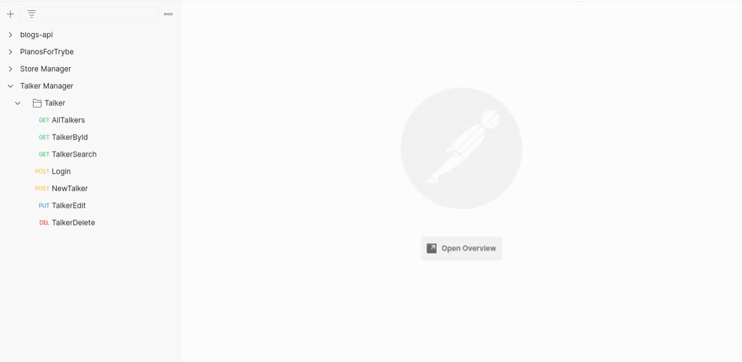

<div align="center"> 
    
</div>

<br>
<br>

<br>
<br>

# Sumario
   - [Sobre](#sobre)
   - [Tecnologias](#tecnologias-utilizadas)
   - [Habilidades](#habilidades-desenvolvidas)
   - [Instruções](#instruções)
#

# Sobre

### Projeto desenvolvido enquanto estudante na [trybe](https://www.betrybe.com/formacao-desenvolvimento-web), Meu primeiro projeto desenvolvido com nodeJs, o projeto foi todo desenvolvido no arquivo index.js, conta com 8 rotas e 8 middlewares de validação das regras de negócio, os diferenciais desse projeto são diversas validações nas rotas, incluindo um token gerado com 16 caracteres. 

#

# Tecnologias utilizadas
- [Postman](https://www.postman.com/)
- [MySQL Workbench](https://www.mysql.com/products/workbench/)
- [Node.js](https://nodejs.org/en/about/)
- [express](https://expressjs.com/pt-br/)

#

# Habilidades desenvolvidas
- Realizar operações assíncronas utilizando callbacks;
- Realizar operações assíncronas utilizando Promises;
- Ler e escrever arquivos localmente com NodeJS;
- Escrever seus próprios scripts que criam e consomem Promises;
- Reescrever código que usa callbacks para que use Promises;
- Realizar chamadas de funções de forma consciente;
- Entender o que é o HTTP, o que é uma API e o que os dois têm a ver com o Express;
- Escrever APIs utilizando Node e Express;
- Entender a estrutura de uma aplicação Express e como organizar seu código;
- Criar rotas e aplicar middlewares.


#

# Instruções

```bash
    # Clonar repositório

    $ git clone git@github.com:furquin/talker-manager.git

    # Entrar no diretório

    $ cd talker-manager

    # Instalar dependências

    $ npm install

    # Iniciar a aplicação

    $ npm run dev

```

<br>
<br>
<br>

### Desenvolvido por [Laert Furquin](https://github.com/furquin) 
